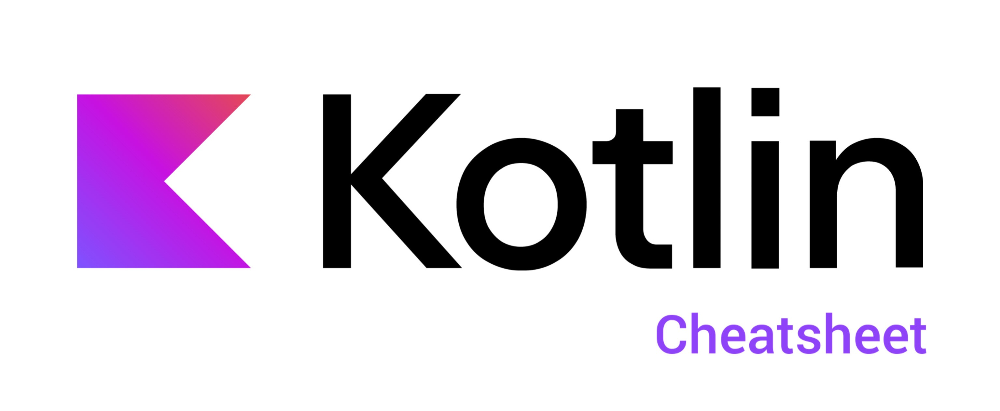

# Cheat Sheet for "Associate Android Developer certification" in Kotlin

This is a guie brown whit the propose to help me and others when you need to review all or kind all lesson in the official documentation of kotlin by google, i take inspiration in this other project [Kotlin-cheat-sheet](https://github.com/alidehkhodaei/kotlin-cheat-sheet?tab=readme-ov-file) by [Ali Dehkhodaei](https://github.com/alidehkhodaei) and if this content was useful for you i achievement to give one ⭐ in his repository also you learn with more details in the [Training courses](https://developer.android.com/courses) what gif google for prepare the exam.I apologize in advance because I also use this space to practice my english😅.



# Table of Contents

- [Android Basics with Compose (lvl: Beginner)](#Android-Basics-with-Compose-(lvl:-Beginner))
  - [Unit 1: Your first Android app](#Unit-1:-Your-first-Android-app)
    - [Introduction to Kotlin](#Introduction-to-Kotlin)
      - [Create and use variables in Kotlin](#Create-and-use-variables-in-Kotlin)
    - [Build a basic layout](#Build-a-basic-layout)
      - [Build a simple app with text composables](#Build-a-simple-app-with-text-composables)
      - [Add images to your Android app](#Add-images-to-your-Android-app)
  - [Unit 2: Building app UI](#Unit-2:-Building-app-UI)
- [Android quizzes (lvl: Beginner)](#Android-quizzes-(lvl:-Beginner))
  - [Unit 1:](#Unit-1:)
    - [Introduction to Kotlin(quiz 1)](#Introduction-to-Kotlin(quiz-1))
    - [Setup Android Studio(quiz 2)](#Setup-Android-Studio(quiz-2))
    - [Build a basic layout(quiz 3)](#Build-a-basic-layout(quiz-2))

# Android Basics with Compose (lvl: Beginner)

## Unit 1: Your first Android app
## Introduction to Kotlin
### Create and use variables in Kotlin
#### **Data types**
 When you decide what aspects of your app can be variable, it's important to specify what type of data can be stored in those variables. In Kotlin, there are some common basic data types. The table below shows a different data type in each row. For each data type, there's a description of what kind of data it can hold and example values.


If you need to update the value of a variable, declare the variable with the Kotlin keyword `var`, instead of `val`

* `val` keyword - Use when you expect the variable value will not change.
* `var` keyword - Use when you expect the variable value can change.
#### **Commenting in your code(examples)**
``// This is a comment.``
```
/*
 * This is a very long comment that can
 * take up multiple lines.
 */
 ```

## Build a basic layout
### Build a simple app with text composables

#### **Composable functions**
Composable functions are the basic building block of a UI in Compose. A composable function:

* Describes some part of your UI.
* Doesn't return anything.
* Takes some input and generates what's shown on the screen.
example:
```
@Preview(showBackground = true)
@Composable
fun BirthdayCardPreview() {
    HappyBirthdayTheme {
        Greeting("Android")
    }
}
```
The Composable function is annotated with the `@Composable` annotation; this annotation informs the Compose compiler that this function is intended to convert data into UI.
#### **Arrange the text elements in a row and column**
The three basic standard layout elements in Compose are `Column`, `Row`, and `Box`. They are Composable functions that take Composable content, so you can place items inside. For example, each child within a `Row` will be placed horizontally next to each other.


### Add images to your Android app
* The `Resource Manager` tab in Android Studio helps you add and organize your images and other resources.
```
val image = painterResource(R.drawable.androidparty)
```
* An `Image` composable is a UI element that displays images in your app.
* An `Image` composable should have a content description to make your app more accessible.
```
Image(
    painter = image,
    contentDescription = null,
    contentScale = ContentScale.Crop
)
```
* Text that's shown to the user, such as the birthday greeting, should be extracted into a string resource to make it easier to translate your app into other languages.

# Android quizzes (lvl: Beginner)

## Unit 1:
### Introduction to Kotlin(quiz 1)

1. Which of the following variable declarations is valid?
  * `var hello: Int? = ""`
  * `String "hello" = hello`
  * 🟢 `val hello = "hello"` 🟢
  * `hello: String = "hello"`

2. It is considered best practice to declare a variable that will not change using `var` instead of `val`.
  * True
  * 🟢 False 🟢

3. Which of the following are valid ways to update a variable? (Choose as many answers as you see fit.)
  * 🟢 `total++` 🟢
  * `total - 1`
  * 🟢 `total--` 🟢
  * 🟢 `total = total + 1` 🟢

4. In Kotlin, comments can be single or multi-line and are ignored by the compiler.
  * 🟢 True 🟢
  * False

5. Which of the following is not a data type in Kotlin?
  * `String`
  * 🟢 `Decimal` 🟢
  * `Int`
  * `Boolean`

6. Float also represents a decimal, but is less precise than Double.
  * 🟢 True 🟢
  * False

7. In Kotlin, the entrypoint of a program is the ___.
  * `println()` statement
  * `val` variable
  * 🟢 `main()` function 🟢
  * `return` statement

8. Which of the following are true about function return values? (Choose as many answers as you see fit.)
  * 🟢 If a function does not specify a return type, the return type is `Unit`. 🟢
  * 🟢 A return value can be stored in a variable. 🟢
  * Functions with a return type of `Unit` must include a `return` statement.
  * 🟢 A return value's type must match the return type of a function. 🟢

9. Which of the following are true about functions? (Choose as many answers as you see fit.)
  * 🟢 Functions can take parameters, or variables as inputs. 🟢
  * Function parameters are required to have default arguments.
  * 🟢 When calling a function with parameters, the values passed in are called arguments. 🟢
  * 🟢 Breaking up your code into separate functions makes your code easier to maintain. 🟢

10. With named arguments, you can change the order in which you pass arguments into a function.
  * 🟢 True 🟢
  * False

### Setup Android Studio(quiz 2)


1. What does IDE stand for?
  * 🟢 Integrated Development Environment 🟢
  * Independent Design Environment
  * Ideal Developer Environment
  * Intelligent Design Environment

2. Which of the following are advantages of using Android Studio? (Choose as many answers as you see fit.)
  * 🟢 It can help prevent typos and other mistakes in your code. 🟢
  * 🟢 It comes with a virtual device called an emulator that can run your app. 🟢
  * 🟢 It can show you a real-time preview of how your app will look on-screen while you code. 🟢
  * It can automatically translate your app into other languages.

3. What is the purpose of using a virtual device, or emulator, in Android Studio?
  * To show a variety of error messages to users
  * To experiment with app code safely
  * 🟢 To test your app on a device without having that physical device 🟢
  * To see what your app looks like in a web browser

4. In Android Studio, what is a project template good for? (Choose as many answers as you see fit.)
  * It causes Android Studio to download files faster.
  * 🟢 It makes getting started on building a new app faster. 🟢
  * 🟢 It provides a structure that follows best practices. 🟢
  * It is the only way to build apps that can be previewed in Android Studio.
  * 🟢 It makes building a new app less error-prone by pre-populating the project with some app code. 🟢

5. How do you create a new project in Android Studio?
  * A. Log out of Android Studio, and navigate to your project folder to find instructions.
  * B. If you have a project already open, select File > New > New Project from the Android Studio menu.
  * C. In the “Welcome to Android Studio” window, click “Start a new Android Studio project.”
  * D. Create a new file on your computer, and title it “New Android Studio Project."
  * 🟢 Both B and C are ways to create a new project in Android Studio. 🟢
  * None of the above

6. ___ is a function that is used to define a layout in your app using Composable functions.
  * `ComponentActivity()`
  * `onCreate()`
  * `DefaultPreview()`
  * 🟢 `setContent()` 🟢

7. A Compose function requires the `@Composable` annotation.
  * 🟢 True 🟢
  * False

8. A ___ is a Composable that has a background color and can contain other Composables.
  * Color
  * Container
  * 🟢 Surface 🟢
  * Box

9. Padding is an example of a ___
  * Property
  * Composable
  * Attribute
  * 🟢 Modifier 🟢

10. Which of the following is false about Compose?
  * The Empty Compose Activity template is used to create a simple app.
  * Layouts can be viewed in the Preview window, without actually running your app.
  * 🟢 All elements and themes in a Compose app are contained in a Surface. 🟢
  * Themes, such as `GreetingCardTheme` allow you to style Composables.

### Build a basic layout(quiz 3)

1. What is Jetpack Compose?
  - Toolkit to design libraries
  - Database Interface
  - Plugin to build APK
  - 🟢 A Modern toolkit to develop Android UI 🟢

2. Composable functions are the basic building block of Compose.
  - True
  - 🟢 True 🟢
  - False

3. What annotation is used to annotate a Composable function?
  - `@Annotation`
  - `@ComposableFunction`
  - 🟢 `@Composable` 🟢
  - `@Preview`

4. The basic standard layout elements in Compose are: (Choose as many answers as you see fit.)
  - 🟢 Column 🟢
  - 🟢 Row 🟢
  - Text
  - 🟢 Box 🟢

5. What is the tool window for importing, creating, managing, and using resources in your app?
  - Application Manager
  - 🟢 Resource Manager 🟢
  - Resource Tool
  - Layout Manager

6. Which class is an automatically generated class by Android that contains the IDs of all resources in the project?
  - The `Android` class
  - The `Resource` class
  - 🟢 The `R` Class 🟢
  - The `ResourceID` class

7. Which function is used to load a drawable image resource?
  - The `stringResource()` function
  - 🟢 The `painterResource()` function 🟢
  - The `ImageResource()` function
  - The `loadResource()` function

8. What is the function parameter used to add accessibility text, used by talkback?
  - `accessibilityText`
  - `contentText`
  - `accessibilityDescription`
  - 🟢 `contentDescription` 🟢

9. The Box layout stacks the UI elements on top of one another.
  - 🟢 True 🟢
  - False

10. What parameter is used to align the child element to the beginning of the parent?
  - `Alignment.End`
  - `Alignment.Begin`
  - 🟢 `Alignment.Start` 🟢
  - `Alignment.Top`


