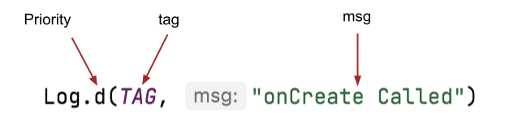
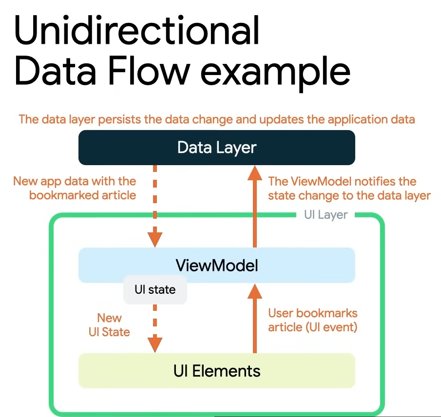

# Cheat Sheet for "Associate Android Developer certification" in Kotlin

This is a guie brown whit the propose to help me and others when you need to review all or kind all lesson in the official documentation of kotlin by google, i take inspiration in this other project [Kotlin-cheat-sheet](https://github.com/alidehkhodaei/kotlin-cheat-sheet?tab=readme-ov-file) by [Ali Dehkhodaei](https://github.com/alidehkhodaei) and if this content was useful for you i achievement to give one ⭐ in his repository also you learn with more details in the [Training courses](https://developer.android.com/courses) what gif google for prepare the exam.I apologize in advance because I also use this space to practice my english😅.


# Table of Contents

- [Android Basics with Compose (lvl: Beginner)](#Android-Basics-with-Compose-(lvl:-Beginner))

  - [Unit 1: Your first Android app](#Unit-1:-Your-first-Android-app)
    - [Introduction to Kotlin](#Introduction-to-Kotlin)
      - [Create and use variables in Kotlin](#Create-and-use-variables-in-Kotlin)
    - [Build a basic layout](#Build-a-basic-layout)
      - [Build a simple app with text composables](#Build-a-simple-app-with-text-composables)
      - [Add images to your Android app](#Add-images-to-your-Android-app)

  - [Unit 2: Building app UI](#Unit-2:-Building-app-UI)
    - [Kotlin fundamentals](#Kotlin-fundamentals)
      - [Write conditionals in Kotlin](#Write-conditionals-in-Kotlin)
      - [Use classes and objects in Kotlin](#Use-classes-and-objects-in-Kotlin)
      - [Use function types and lambda expressions in Kotlin](#Use-function-types-and-lambda-expressions-in-Kotlin)
    - [Add a button to an app](#Add-a-button-to-an-app)
    - [Interacting with UI and state](#Interacting-with-UI-and-state)
      -[Intro to state in Compose](#Intro-to-state-in-Compose)
      -[Write automated tests](#Write-automated-tests)

  - [Unit 3: Unit 3: Display lists and use Material Design](#Unit-3:-Display-lists-and-use-Material-Design)
    - [More Kotlin fundamentals](#More-Kotlin-fundamentals)
      -[Generics, objects, and extensions](#Generics,-objects,-and-extensions)
      -[Use collections in Kotlin](#Use-collections-in-Kotlin)
      -[Higher-order functions with collections](#Higher-order-functions-with-collections)
    - [Build a scrollable list](#Build-a-scrollable-list)
    - [Build beautiful apps](#Build-beautiful-apps)

  - [Unit 4: Navigation and app architecture](#Unit-4:-Navigation-and-app-architecture)
    - [Architecture Components](#Architecture-Components)
    - [Navigation in Jetpack Compose](#Navigation-in-Jetpack-Compose)
    - [Adapt for different screen sizes](#Adapt-for-different-screen-sizes)

  - [Unit 5: Connect to the internet](#Unit-5:-Connect-to-the-internet)
    - [Get data from the internet](#Get-data-from-the-internet)
    - [Load and display images from the internet](#Load-and-display-images-from-the-internet)

- [Android quizzes (lvl: Beginner)](#Android-quizzes-(lvl:-Beginner))

  - [Unit 1:](#Unit-1:)
    - [Introduction to Kotlin(quiz 1)](#Introduction-to-Kotlin(quiz-1))
    - [Setup Android Studio(quiz 2)](#Setup-Android-Studio(quiz-2))
    - [Build a basic layout(quiz 3)](#Build-a-basic-layout(quiz-2))

  - [Unit 2:](#Unit-2:)
    - [Kotlin fundamentals(quiz 1)](#Kotlin-fundamentals(quiz-1))
    - [Add a button to an app(quiz 2)](#Add-a-button-to-an-app(quiz-2))
    - [Interacting with UI and state(quiz 3)](#Interacting-with-UI-and-state(quiz-3))

  - [Unit 3:](#Unit-3:)
    - [More Kotlin fundamentals(quiz 1)](#More-Kotlin-fundamentals(quiz-1))
    - [Build a scrollable list(quiz 2)](#Build-a-scrollable-list(quiz-2))
    - [Build beautiful apps(quiz 3)](#Build-beautiful-apps(quiz-3))

  - [Unit 4:](#Unit-4:)
    - [Architecture Components(quiz 1)](#Architecture-Components(quiz-1))
    - [Navigation in Jetpack Compose(quiz 2)](#Navigation-in-Jetpack-Compose(quiz-2))
    - [Adapt for different screen sizes(quiz 3)](#Adapt-for-different-screen-sizes(quiz-3))

  - [Unit 5:](#Unit-5:)
  - [Get data from the internet(quiz 1)](#Get-data-from-the-internet(quiz-1))
    - [Load and display images from the internet(quiz 2)](#Load-and-display-images-from-the-internet(quiz-2))

# Android Basics with Compose (lvl: Beginner)

## Unit 1: Your first Android app
## Introduction to Kotlin
### Create and use variables in Kotlin
#### **Data types**
 When you decide what aspects of your app can be variable, it's important to specify what type of data can be stored in those variables. In Kotlin, there are some common basic data types. The table below shows a different data type in each row. For each data type, there's a description of what kind of data it can hold and example values.


If you need to update the value of a variable, declare the variable with the Kotlin keyword `var`, instead of `val`

* `val` keyword - Use when you expect the variable value will not change.
* `var` keyword - Use when you expect the variable value can change.
#### **Commenting in your code(examples)**
``// This is a comment.``
```kotlin
/*
 * This is a very long comment that can
 * take up multiple lines.
 */
 ```

## Build a basic layout
### Build a simple app with text composables

#### **Composable functions**
Composable functions are the basic building block of a UI in Compose. A composable function:

* Describes some part of your UI.
* Doesn't return anything.
* Takes some input and generates what's shown on the screen.
example:
```kotlin
@Preview(showBackground = true)
@Composable
fun BirthdayCardPreview() {
    HappyBirthdayTheme {
        Greeting("Android")
    }
}
```
The Composable function is annotated with the `@Composable` annotation; this annotation informs the Compose compiler that this function is intended to convert data into UI.
#### **Arrange the text elements in a row and column**
The three basic standard layout elements in Compose are `Column`, `Row`, and `Box`. They are Composable functions that take Composable content, so you can place items inside. For example, each child within a `Row` will be placed horizontally next to each other.


### Add images to your Android app
* The `Resource Manager` tab in Android Studio helps you add and organize your images and other resources.
```kotlin
val image = painterResource(R.drawable.androidparty)
```
* An `Image` composable is a UI element that displays images in your app.
* An `Image` composable should have a content description to make your app more accessible.
```kotlin
Image(
    painter = image,
    contentDescription = null,
    contentScale = ContentScale.Crop
)
```
* Text that's shown to the user, such as the birthday greeting, should be extracted into a string resource to make it easier to translate your app into other languages.

## Unit 2: Building app UI
## Kotlin fundamentals
### Write conditionals in Kotlin
#### **Use if/else statements to express conditions**
After the closing curly brace of the `if` statement, you add the `else` keyword followed by a pair of curly braces. Inside the curly braces of the `else` statement, you can add a second body that only executes when the condition in the `if` branch is false.

The `else` branch is always located at the end of an `if/else` statement because it's a catchall branch. It automatically executes when all other conditions in the preceding branches aren't satisfied. As such, the `else` branch isn't suitable when you want an action to execute only when it satisfies a specific condition. In the case of the traffic light, you can use the `else if` branch to specify the condition for green lights.
* Example:
```kotlin
fun main() {
    val trafficLightColor = "Black"

    if (trafficLightColor == "Red") {
        println("Stop")
    } else if (trafficLightColor == "Yellow") {
        println("Slow")
    } else if (trafficLightColor == "Green") {
        println("Go")
    } else {
        println("Invalid traffic-light color")
    }
}
```
#### **Use a when statement for multiple branches**
In Kotlin, when you deal with multiple branches, you can use the `when` statement instead of the `if/else` statement because it improves readability, which refers to how easy it is for human readers, typically developers, to read the code. It's very important to consider readability when you write your code because it's likely that other developers need to review and modify your code throughout its lifetime. Good readability ensures that developers can correctly understand your code and don't inadvertently introduce bugs into it.
* Example:
```kotlin
fun main() {
    val x: Any = 20

    when (x) {
        2, 3, 5, 7 -> println("x is a prime number between 1 and 10.")
        in 1..10 -> println("x is a number between 1 and 10, but not a prime number.")
        is Int -> println("x is an integer number, but not between 1 and 10.")
        else -> println("x isn't an integer number.")
    }
}
```
#### **Summary**
* In Kotlin, branching can be achieved with `if/else` or `when` conditionals.
* The body of an `if` branch in an `if/else` conditional is only executed when the boolean expression inside the `if` branch condition returns a `true` value.
* Subsequent `else if` branches in an `if/else` conditional get executed only when previous `if` or `else if` branches return `false` values.
* The final `else` branch in an `if/else` conditional only gets executed when all previous if or `else if` branches return `false` values.
* It's recommended to use the `when` conditional to replace an `if/else` conditional when there are more than two branches.
* You can write more complex conditions in `when` conditionals with the comma `(,)`, `in` ranges, and the `is` keyword.
* `if/else` and `when` conditionals can work as either statements or expressions.

### Use nullability in Kotlin
#### **Summary**
* A variable can be set to `null` to indicate that it holds no value.
* Non-nullable variables cannot be assigned `null`.
* Nullable variables can be assigned `null`.
* To access methods or properties of nullable variables, you need to use `?.` safe-call operators or `!!` not-null assertion operators.
* You can use `if/else` statements with `null` checks to access nullable variables in non-nullable contexts.
* You can convert a nullable variable to a non-nullable type with `if/else` expressions.
* You can provide a default value for when a nullable variable is `null` with the `if/else` expression or the `?:` Elvis operator.

### Use classes and objects in Kotlin
#### **Define a class**
When you define a class, you specify the properties and methods that all objects of that class should have.

A class definition starts with the `class` keyword, followed by a name and a set of curly braces. The part of the syntax before the opening curly brace is also referred to as the class header. In the curly braces, you can specify properties and functions for the class.

A class consists of three major parts:

* `Properties.` Variables that specify the attributes of the class's objects.
* `Methods.` Functions that contain the class's behaviors and actions.
* `Constructors.` A special member function that creates instances of the class throughout the program in which it's defined.

#### **Define a constructor**
The primary purpose of the constructor is to specify how the objects of the class are created. In other words, constructors initialize an object and make the object ready for use. You did this when you instantiated the object. The code inside the constructor executes when the object of the class is instantiated. You can define a constructor with or without parameters.
#### **Specify appropriate visibility modifiers**
This table helps you determine the appropriate visibility modifiers based on where the property or methods of a class or constructor should be accessible:


* Example:
```kotlin
import kotlin.properties.ReadWriteProperty
import kotlin.reflect.KProperty

open class SmartDevice(val name: String, val category: String) {

    var deviceStatus = "online"
        protected set

    open val deviceType = "unknown"

    open fun turnOn() {
        deviceStatus = "on"
    }

    open fun turnOff() {
        deviceStatus = "off"
    }
}

class SmartTvDevice(deviceName: String, deviceCategory: String) :
    SmartDevice(name = deviceName, category = deviceCategory) {

    override val deviceType = "Smart TV"

    private var speakerVolume by RangeRegulator(initialValue = 2, minValue = 0, maxValue = 100)

    private var channelNumber by RangeRegulator(initialValue = 1, minValue = 0, maxValue = 200)

    fun increaseSpeakerVolume() {
        speakerVolume++
        println("Speaker volume increased to $speakerVolume.")
    }

    fun nextChannel() {
        channelNumber++
        println("Channel number increased to $channelNumber.")
    }

    override fun turnOn() {
        super.turnOn()
        println(
            "$name is turned on. Speaker volume is set to $speakerVolume and channel number is " +
                "set to $channelNumber."
        )
    }

    override fun turnOff() {
        super.turnOff()
        println("$name turned off")
    }
}

class SmartLightDevice(deviceName: String, deviceCategory: String) :
    SmartDevice(name = deviceName, category = deviceCategory) {

    override val deviceType = "Smart Light"

    private var brightnessLevel by RangeRegulator(initialValue = 0, minValue = 0, maxValue = 100)

    fun increaseBrightness() {
        brightnessLevel++
        println("Brightness increased to $brightnessLevel.")
    }

    override fun turnOn() {
        super.turnOn()
        brightnessLevel = 2
        println("$name turned on. The brightness level is $brightnessLevel.")
    }

    override fun turnOff() {
        super.turnOff()
        brightnessLevel = 0
        println("Smart Light turned off")
    }
}

class SmartHome(
    val smartTvDevice: SmartTvDevice,
    val smartLightDevice: SmartLightDevice
) {

    var deviceTurnOnCount = 0
        private set

    fun turnOnTv() {
        deviceTurnOnCount++
        smartTvDevice.turnOn()
    }

    fun turnOffTv() {
        deviceTurnOnCount--
        smartTvDevice.turnOff()
    }

    fun increaseTvVolume() {
        smartTvDevice.increaseSpeakerVolume()
    }

    fun changeTvChannelToNext() {
        smartTvDevice.nextChannel()
    }

    fun turnOnLight() {
        deviceTurnOnCount++
        smartLightDevice.turnOn()
    }

    fun turnOffLight() {
        deviceTurnOnCount--
        smartLightDevice.turnOff()
    }

    fun increaseLightBrightness() {
        smartLightDevice.increaseBrightness()
    }

    fun turnOffAllDevices() {
        turnOffTv()
        turnOffLight()
    }
}

class RangeRegulator(
    initialValue: Int,
    private val minValue: Int,
    private val maxValue: Int
) : ReadWriteProperty<Any?, Int> {

    var fieldData = initialValue

    override fun getValue(thisRef: Any?, property: KProperty<*>): Int {
        return fieldData
    }

    override fun setValue(thisRef: Any?, property: KProperty<*>, value: Int) {
        if (value in minValue..maxValue) {
            fieldData = value
        }
    }
}

fun main() {
    var smartDevice: SmartDevice = SmartTvDevice("Android TV", "Entertainment")
    smartDevice.turnOn()

    smartDevice = SmartLightDevice("Google Light", "Utility")
    smartDevice.turnOn()
}
```
#### **summary**
* There are four main principles of OOP: encapsulation, abstraction, inheritance, and polymorphism.
* Classes are defined with the `class` keyword, and contain properties and methods.
* Properties are similar to variables except properties can have custom getters and setters.
* A constructor specifies how to instantiate objects of a class.
* You can omit the `constructor` keyword when you define a primary constructor.
* Inheritance makes it easier to reuse code.
* The IS-A relationship refers to inheritance.
* The HAS-A relationship refers to composition.
* Visibility modifiers play an important role in the achievement of encapsulation.
* Kotlin provides four visibility modifiers: the `public`, `private`, `protected`, and `internal` modifiers.
* A property delegate lets you reuse the getter and setter code in multiple classes.

### Use function types and lambda expressions in Kotlin
#### **Write lambda expressions with shorthand syntax**
Lambda expressions provide a variety of ways to make your code more concise. You explore a few of them in this section because most of the lambda expressions that you encounter and write are written with shorthand syntax.
**Omit parameter name**
When you wrote the `coins()` function, you explicitly declared the name `quantity` for the function's `Int` parameter. However, as you saw with the `cupcake()` function, you can omit the parameter name entirely. When a function has a single parameter and you don't provide a name, Kotlin implicitly assigns it the `it` name, so you can omit the parameter name and `->` symbol, which makes your lambda expressions more concise. The syntax is illustrated in this image:


**Summary**
* Functions in Kotlin are first-class constructs and can be treated like data types.
* Lambda expressions provide a shorthand syntax to write functions.
* You can pass function types into other functions.
* You can return a function type from another function.
* A lambda expression returns the value of the last expression.
* If a parameter label is omitted in a lambda expression with a single parameter, it's referred to with the `it` identifier.
* Lambdas can be written inline without a variable name.
* If a function's last parameter is a function type, you can use trailing lambda syntax to move the lambda expression after the last parenthesis when you call a function.
* Higher-order functions are functions that take other functions as parameters or return a function.
* The `repeat()` function is a higher-order function that works similarly to a `for` loop.
## Add a button to an app
* Define composable functions.
* Create layouts with Compositions.
* Create a button with the `Button` composable.
* Import `drawable` resources.
* Display an image with the `Image` composable.
* Make an interactive UI with composables.
* Use the `remember` composable to store objects in a Composition to memory.
* Refresh the UI with the `mutableStateOf()` function to make an observable.

* Attach the debugger to an app.
* Launch an app with the debugger already attached.
* Gain familiarity with the debugger pane.
* Set a breakpoint.
* Resume the program from the debugger.
* Use the `Step Into` button.
* Use the `Step Over` button.
* Use the `Step Out` button.
* Inspect variables with the debugger.
## Interacting with UI and state
### Intro to state in Compose
* State in an app is any value that can change over time.
* The Composition is a description of the UI built by Compose when it executes composables.Compose apps call composable functions to transform data into UI.
* Initial composition is a creation of the UI by Compose when it executes composable functions the first time.
* Recomposition is the process of running the same composables again to update the tree when their data changes.
* State hoisting is a pattern of moving state to its caller to make a component stateless.
### Write automated tests
* What automated tests are.
* Why automated tests are important.
* The difference between local tests and instrumentation tests
* Fundamental best practices for writing automated tests.
* Where to find and place local and instrumentation test classes in an Android project.
* How to create a test method.
* How to create local and instrumentation test classes.
* How to make assertions in local and instrumentation tests.
* How to use test rules.
* How to use `ComposeTestRule` to launch the app with a test.
* How to interact with composables in an instrumentation test.
* How to run tests.


## Unit 3: Unit 3: Display lists and use Material Design
## More Kotlin fundamentals
### Generics, objects, and extensions
#### **Make a reusable class with generics**
* Example:
```kotlin

enum class Difficulty {
    EASY, MEDIUM, HARD
}

class Question<T>(
    val questionText: String,
    val answer: T,
    val difficulty: String
)

val question1 = Question<String>("Quoth the raven ___", "nevermore", Difficulty.MEDIUM)
val question2 = Question<Boolean>("The sky is green. True or false", false, Difficulty.EASY)
val question3 = Question<Int>("How many days are there between full moons?", 28, Difficulty.HARD)
```
#### **Use a data class**
To define a data class, simply add the `data` keyword before the `class` keyword.
When a class is defined as a data class, the following methods are implemented.

* `equals()`
* `hashCode()`: you'll see this method when working with certain collection types.
* `toString()`
* `componentN()`: `component1()`, `component2()`, etc.
* `copy()`

* Example:
```kotlin
data class Question<T>(
    val questionText: String,
    val answer: T,
    val difficulty: Difficulty
)

fun main() {
    val question1 = Question<String>("Quoth the raven ___", "nevermore", Difficulty.MEDIUM)
    val question2 = Question<Boolean>("The sky is green. True or false", false, Difficulty.EASY)
    val question3 = Question<Int>("How many days are there between full moons?", 28, Difficulty.HARD)
    println(question1.toString())
}
```
* show this:
```kotlin
Question(questionText=Quoth the raven ___, answer=nevermore, difficulty=MEDIUM)
```

#### **Use a singleton object**
There are many scenarios where you want a class to only have one instance. For example:

* Player stats in a mobile game for the current user.
* Interacting with a single hardware device, like sending audio through a speaker.
* An object to access a remote data source (such as a Firebase database).
* Authentication, where only one user should be logged in at a time.

In the above scenarios, you'd probably need to use a class. However, you'll only ever need to instantiate one instance of that class. If there's only one hardware device, or only one user logged in at once, there would be no reason to create more than a single instance. Having two objects that access the same hardware device simultaneously could lead to some really strange and buggy behavior.

You can clearly communicate in your code that an object should have only one instance by defining it as a singleton. A singleton is a class that can only have a single instance. Kotlin provides a special construct, called an object, that can be used to make a singleton class.

**Declare objects as companion objects**
Classes and objects in Kotlin can be defined inside other types, and can be a great way to organize your code. You can define a singleton object inside another class using a companion object. A companion object allows you to access its properties and methods from inside the class, if the object's properties and methods belong to that class, allowing for more concise syntax.

To declare a companion object, simply add the `companion` keyword before the `object` keyword.
* Example:
```kotlin
class Quiz {
    val question1 = Question<String>("Quoth the raven ___", "nevermore", Difficulty.MEDIUM)
    val question2 = Question<Boolean>("The sky is green. True or false", false, Difficulty.EASY)
    val question3 = Question<Int>("How many days are there between full moons?", 28, Difficulty.HARD)

    companion object StudentProgress {
        var total: Int = 10
        var answered: Int = 3
    }
}

fun main() {
    println("${Quiz.answered} of ${Quiz.total} answered.")
}

// 3 of 10 answered.
```
**Extend classes with new properties and methods**
To define an extension property, add the type name and a dot operator (.) before the variable name.
```kotlin
val Quiz.StudentProgress.progressText: String
    get() = "${answered} of ${total} answered"

fun main() {
  println(Quiz.progressText)
}

//3 of 10 answered.
```
* Example with Functions:
```kotlin
fun Quiz.StudentProgress.printProgressBar() {
    repeat(Quiz.answered) { print("▓") }
    repeat(Quiz.total - Quiz.answered) { print("▒") }
    println()
    println(Quiz.progressText)
}

fun main() {
    Quiz.printProgressBar()
}

//▓▓▓▒▒▒▒▒▒▒
//3 of 10 answered.
```

**Use scope functions to access class properties and methods**
```kotlin
fun printQuiz() {
    question1.let {
        println(it.questionText)
        println(it.answer)
        println(it.difficulty)
    }
    println()
    question2.let {
        println(it.questionText)
        println(it.answer)
        println(it.difficulty)
    }
    println()
    question3.let {
        println(it.questionText)
        println(it.answer)
        println(it.difficulty)
    }
    println()
}


fun main() {
    val quiz = Quiz()
    quiz.printQuiz()
}

//other way
Quiz().apply {
    printQuiz()
}


//PRINT---->
//Quoth the raven ___
//nevermore
//MEDIUM

//The sky is green. True or false
//false
//EASY

//How many days are there between full moons?
//28
//HARD
```

### Use collections in Kotlin
**Arrays in Kotlin**
An array is the simplest way to group an arbitrary number of values in your programs.

Like a grouping of solar panels is called a solar array, or how learning Kotlin opens up an array of possibilities for your programming career, an `Array` represents **more than one value.** Specifically, an array is a sequence of values that all have the same data type.
* Example:
```kotlin
val rockPlanets = arrayOf<String>("Mercury", "Venus", "Earth", "Mars")
val gasPlanets = arrayOf("Jupiter", "Saturn", "Uranus", "Neptune")

```
**Lists**
A list is an ordered, resizable collection, typically implemented as a resizable array. When the array is filled to capacity and you try to insert a new element, the array is copied to a new bigger array.
With a list, you can also insert new elements between other elements at a specific index.
**List and MutableList**
The collection types you'll encounter in Kotlin implement one or more interfaces. As you learned in the Generics, objects, and extensions codelab earlier in this unit, interfaces provide a standard set of properties and methods for a class to implement. A class that implements the List interface provides implementations for all the properties and methods of the List interface. The same is true for MutableList.

So what do List and MutableList do?

* `List` is an interface that defines properties and methods related to a read-only ordered collection of items.
* `MutableList` extends the List interface by defining methods to modify a list, such as adding and removing elements.

* Example `listOf()`:

```kotlin
fun main() {
    val solarSystem = listOf("Mercury", "Venus", "Earth", "Mars", "Jupiter", "Saturn", "Uranus", "Neptune")
}
println(solarSystem[2])
println(solarSystem.get(3))

//print
//Earth
//Mars
```
* Example `mutableListOf()`:
```kotlin
val solarSystem = mutableListOf("Mercury", "Venus", "Earth", "Mars", "Jupiter", "Saturn", "Uranus", "Neptune")

solarSystem.add("Pluto")
solarSystem.add(3, "Theia")
solarSystem.removeAt(9)
solarSystem.remove("Future Moon")
println("Future Moon" in solarSystem)
```

**Set**
A set is a collection that does not have a specific order and does not allow duplicate values.

Like `List` and `MutableList`, there's both a `Set` and a `MutableSet`. `MutableSet` implements `Set`, so any class implementing `MutableSet` needs to implement both.

* Example of `MutableSet`:
```kotlin
val solarSystem = mutableSetOf("Mercury", "Venus", "Earth", "Mars", "Jupiter", "Saturn", "Uranus", "Neptune")

println(solarSystem.size)
solarSystem.add("Pluto")
println(solarSystem.contains("Pluto"))
```

**Map**
A `Map` is a collection consisting of keys and values. It's called a map because unique keys are mapped to other values. A key and its accompanying value are often called a `key-value pair`.
* Example:
```kotlin
val solarSystem = mutableMapOf(
    "Mercury" to 0,
    "Venus" to 0,
    "Earth" to 1,
    "Mars" to 2,
    "Jupiter" to 79,
    "Saturn" to 82,
    "Uranus" to 27,
    "Neptune" to 14
)

println(solarSystem.size)
solarSystem["Pluto"] = 5
println(solarSystem.size)
println(solarSystem["Pluto"])
println(solarSystem.get("Theia"))

//print
//8
//9
//5
//null
```

### Higher-order functions with collections
**forEach() and string templates with lambdas**
* Example:
```kotlin
class Cookie(
    val name: String,
    val softBaked: Boolean,
    val hasFilling: Boolean,
    val price: Double
)

val cookies = listOf(
    Cookie(
        name = "Chocolate Chip",
        softBaked = false,
        hasFilling = false,
        price = 1.69
    ),
    Cookie(
        name = "Banana Walnut",
        softBaked = true,
        hasFilling = false,
        price = 1.49
    ),
    Cookie(
        name = "Vanilla Creme",
        softBaked = false,
        hasFilling = true,
        price = 1.59
    ),
    Cookie(
        name = "Chocolate Peanut Butter",
        softBaked = false,
        hasFilling = true,
        price = 1.49
    ),
    Cookie(
        name = "Snickerdoodle",
        softBaked = true,
        hasFilling = false,
        price = 1.39
    ),
    Cookie(
        name = "Blueberry Tart",
        softBaked = true,
        hasFilling = true,
        price = 1.79
    ),
    Cookie(
        name = "Sugar and Sprinkles",
        softBaked = false,
        hasFilling = false,
        price = 1.39
    )
)

fun main() {
  cookies.forEach {
    println("Menu item: ${it.name}")
  }
}

//print
//Menu item: Chocolate Chip
//Menu item: Banana Walnut
//Menu item: Vanilla Creme
//Menu item: Chocolate Peanut Butter
//Menu item: Snickerdoodle
//Menu item: Blueberry Tart
//Menu item: Sugar and Sprinkles
```
**map()**
The `map()` function lets you transform a collection into a new collection with the same number of elements. For example, `map()` could transform a `List<Cookie>` into a `List<String>` only containing the cookie's `name`, provided you tell the `map()` function how to create a String from each `Cookie` item.
* Example:
```kotlin
val fullMenu = cookies.map {
    "${it.name} - $${it.price}"
}

val fullMenu = cookies.map {
    "${it.name} - $${it.price}"
}

//print
//Full menu:
//Chocolate Chip - $1.69
//Banana Walnut - $1.49
//Vanilla Creme - $1.59
//Chocolate Peanut Butter - $1.49
//Snickerdoodle - $1.39
//Blueberry Tart - $1.79
//Sugar and Sprinkles - $1.39
```
**filter()**
The `filter()` function lets you create a subset of a collection. For example, if you had a list of numbers, you could use `filter()` to create a new list that only contains numbers divisible by 2.
* Example:
```kotlin
val softBakedMenu = cookies.filter {
    it.softBaked
}

println("Soft cookies:")
softBakedMenu.forEach {
    println("${it.name} - $${it.price}")
}

//print
//Soft cookies:
//Banana Walnut - $1.49
//Snickerdoodle - $1.39
//Blueberry Tart - $1.79

```

**groupBy()**
The `groupBy()` function can be used to turn a list into a map, based on a function. Each unique return value of the function becomes a key in the resulting map. The values for each key are all the items in the collection that produced that unique return value.

The data type of the keys is the same as the return type of the function passed into `groupBy()`. The data type of the values is a list of items from the original list.
* Example:
```kotlin
val groupedMenu = cookies.groupBy { it.softBaked }


val softBakedMenu = groupedMenu[true] ?: listOf()
val crunchyMenu = groupedMenu[false] ?: listOf()


println("Soft cookies:")
softBakedMenu.forEach {
    println("${it.name} - $${it.price}")
}
println("Crunchy cookies:")
crunchyMenu.forEach {
    println("${it.name} - $${it.price}")
}

//print
//Soft cookies:
//Banana Walnut - $1.49
//Snickerdoodle - $1.39
//Blueberry Tart - $1.79
//Crunchy cookies:
//Chocolate Chip - $1.69
//Vanilla Creme - $1.59
//Chocolate Peanut Butter - $1.49
//Sugar and Sprinkles - $1.39
```

**fold()**
The `fold()` function is used to generate a single value from a collection. This is most commonly used for things like calculating a total of prices, or summing all the elements in a list to find an average.

The fold() function takes two parameters:

* An initial value. The data type is inferred when calling the function (that is, an initial value of 0 is inferred to be an Int).
* A lambda expression that returns a value with the same type as the initial value.

The lambda expression additionally has two parameters:

* The first is known as the accumulator. It has the same data type as the initial value. Think of this as a running total. Each time the lambda expression is called, the accumulator is equal to the return value from the previous time the lambda was called.
* The second is the same type as each element in the collection.
* Example:
```kotlin
val totalPrice = cookies.fold(0.0) {total, cookie ->
    total + cookie.price
}
println("Total price: $${totalPrice}")

//print
//Total price: $10.83
```

**sortedBy()**
When you first learned about collections, you learned that the `sort()` function could be used to sort the elements. However, this won't work on a collection of `Cookie` objects. The `Cookie` class has several properties and Kotlin won't know which properties (`name`, `price`, etc.) you want to sort by.

For these cases, Kotlin collections provide a `sortedBy()` function. `sortedBy()` lets you specify a lambda that returns the property you'd like to sort by. For example, if you'd like to sort by `price`, the lambda would return `it.price`. So long as the data type of the value has a natural sort order—strings are sorted alphabetically, numeric values are sorted in ascending order—it will be sorted just like a collection of that type.
* Example:
```kotlin
val alphabeticalMenu = cookies.sortedBy {
    it.name
}

println("Alphabetical menu:")
alphabeticalMenu.forEach {
    println(it.name)
}

//print
//Alphabetical menu:
//Banana Walnut
//Blueberry Tart
//Chocolate Chip
//Chocolate Peanut Butter
//Snickerdoodle
//Sugar and Sprinkles
//Vanilla Creme
```

**Summary**
* You can loop over each element in a collection using `forEach()`.
* Expressions can be inserted into strings.
* `map()` is used to format the items in a collection, often as a collection of another data type.
* `filter()` can generate a subset of a collection.
* `groupBy()` splits a collection based on a function's return value.
* `fold()` turns a collection into a single value.
* `sortedBy()` is used to sort a collection by a specified property.

## More Kotlin fundamentals
**Summary**
* Use `Card` composables to create list items.
* Modify the UI contained within a `Card` composable.
* Create a scrollable list using the `LazyColumn` composable.
* Build a list using custom list items.

* Place app icon files in the mipmap resource directories.
* Provide different versions of an app icon bitmap image in each density bucket (mdpi, hdpi, xhdpi, xxhdpi, xxxhdpi) for backwards compatibility with older versions of Android.
* Add resource qualifiers onto resource directories to specify resources that should be used on devices with a certain configuration (v24 or v26).
* Vector drawables are Android's implementation of vector graphics. They are defined in XML as a set of points, lines, and curves, along with associated color information. Vector drawables can be scaled for any density without loss of quality.
* Adaptive icons were introduced to the Android platform in API 26. They are made up of a foreground and background layer that follow specific requirements, so that your app icon looks high-quality on a range of devices with different OEM masks.
* Use Image Asset Studio in Android Studio to create legacy and adaptive icons for your app.


## Build beautiful apps
#### **Add Color**
You may wonder what all these roles are and how they are utilized, here are a few of the main ones:

* The **primary** colors are used for key components across the UI.
* The **secondary** colors are used for less prominent components in the UI.
* The **tertiary** colors are used for contrasting accents that can be used to balance primary and secondary colors or bring heightened attention to an element, such as an input field.
* The **on** color elements appear **on top** of other colors in the palette, and are primarily applied to text, iconography, and strokes. In our color palette, we have an **onSurface** color, which appears on top of the **surface** color, and an **onPrimary** color, which appears on top of the **primary** color.

#### **Add typography**
**The Material Design type scale**

A type scale is a selection of font styles that can be used across an app, ensuring a flexible, yet consistent, style. The [Material Design type scale](https://m3.material.io/styles/typography/type-scale-tokens) includes fifteen font styles that are supported by the type system. The naming and grouping have been simplified to: display, headline, title, body, and label, with large, medium, and small sizes for each. You only need to use these choices if you want to customize your app. If you don't know what to set for each type scale category, know that there is a default typography scale that you can use.


`Display:` As the largest text on the screen, display styles are reserved for short, important text or numerals. They work best on large screens.

`Headline:` Headlines are best-suited for short, high-emphasis text on smaller screens. These styles can be good for marking primary passages of text or important regions of content.

`Title:` Titles are smaller than headline styles, and should be used for medium-emphasis text that remains relatively short.

`Body:` Body styles are used for longer passages of text in your app.

`Label:` Label styles are smaller, utilitarian styles, used for things like the text inside components or for very small text in the content body, such as captions.

#### **Add a top bar**

A `Scaffold` is a layout that provides slots for various components and screen elements, such as an `Image`, `Row`, or `Column`. A `Scaffold` also provides a slot for a `TopAppBar`, which you will use in this section.

A `TopAppBar` can be used for many purposes, but in this case, you will use it for branding and to give your app personality. There are four different types of `TopAppBar`: center, small, medium and large. In this codelab you will implement a center top app bar. You will create a composable that looks like the screenshot below, and slot it into the `topBar` section of a `Scaffold`.

## Unit 4: Navigation and app architecture
## Architecture Components
### Explore the lifecycle methods and add basic logging

#### Explore the lifecycle methods and add basic logging
Similarly, the activity lifecycle consists of the different states that an activity can go through, from when the activity first initializes to its destruction, at which time the operating system (OS) reclaims its memory. Typically, the entry point of a program is the `main()` method. Android activities, however, begin with the `onCreate()` method; this method would be the equivalent of the egg stage in the above example. You have used activities already, many times throughout this course, and you might recognize the `onCreate()` method. As the user starts your app, navigates between activities, navigates inside and outside of your app, the activity changes state.


Often, you want to change some behavior, or run some code, when the activity lifecycle state changes. Therefore, the `Activity` class itself, and any subclasses of `Activity` such as `ComponentActivity`, implement a set of lifecycle callback methods. Android invokes these callbacks when the activity moves from one state to another, and you can override those methods in your own activities to perform tasks in response to those lifecycle state changes. The following diagram shows the lifecycle states along with the available overridable callbacks.

**Step 1: Examine the `onCreate()` method and add logging**
A simple way to determine this information is to use the Android logging functionality. Logging enables you to write short messages to a console while the app runs and use it to see when different callbacks are triggered.

Run the Dessert Clicker app and tap several times on the picture of the dessert. Note how the value for **Desserts sold** and the total dollar amount changes.
Open `MainActivity.kt` and examine the `onCreate()` method for this activity:
````kotlin
override fun onCreate(savedInstanceState: Bundle?) {
    // ...
}
````
In the activity lifecycle diagram, you may recognize the `onCreate()` method, because you've used this callback before. It's the one method that every activity must implement. The `onCreate()` method is where you should do any one-time initializations for your activity. For example, in `onCreate()`, you call `setContent()`, which specifies the activity's UI layout.
The `onCreate()` lifecycle method is called once, just after the activity initializes—when the OS creates the new `Activity` object in memory. After `onCreate()` executes, the activity is considered created.

The `Log` class writes messages to the `Logcat`. The `Logcat` is the console for logging messages. Messages from Android about your app appear here, including the messages you explicitly send to the log with the `Log.d()` method or other `Log` class methods.

There are three important aspects of the `Log` instruction:

* The `priority` of the log message, that is, how important the message is. In this case, the `Log.v()` logs verbose messages. `Log.d()` method writes a debug message. Other methods in the `Log` class include `Log.i()` for informational messages, `Log.w()` for warnings, and `Log.e()` for error messages.

* The log `tag` (the first parameter), in this case `"MainActivity"`. The tag is a string that lets you more easily find your log messages in the Logcat. The tag is typically the name of the class.

* The actual log message, called `msg` (the second parameter), is a short string, which in this case is `"onCreate Called"`.



**Step 2: Implement the `onStart()` method**
The `onStart()` lifecycle method is called just after `onCreate()`. After `onStart()` runs, your activity is visible on the screen. Unlike `onCreate()`, which is called only once to initialize your activity, `onStart()`can be called by the system many times in the lifecycle of your activity.

Note that `onStart()`is paired with a corresponding `onStop()`lifecy
cle method. If the user starts your app and then returns to the device's home screen, the activity is stopped and is no longer visible on screen.

1. In Android Studio, with `MainActivity.kt` open and the cursor within the `MainActivity` class, select Code > Override Methods... or press `Control+O`. A dialog appears with a long list of all the methods you can override in this class.
2. Start entering `onStart` to search for the correct method. To scroll to the next matching item, use the down arrow. Choose `onStart() `from the list and click OK to insert the boilerplate override code. The code looks like the following example:

```kotlin
override fun onStart() {
    super.onStart()
}
```
3. Inside the `onStart()` method, add a log message:
```kotlin
override fun onStart() {
  super.onStart()
  Log.d(TAG, "onStart Called")
}
```
4. Compile and run the Dessert Clicker app and open the `Logcat` pane.
5. Type `tag:MainActivity` into the search field to filter the log. Notice that both the `onCreate()` and `onStart()` methods were called one after the other, and that your activity is visible on screen.
6. Press the `Home` button on the device and then use the Recents screen to return to the activity. Notice that the activity resumes where it left off, with all the same values, and that `onStart()` is logged a second time to Logcat. Notice also that the `onCreate()` method is not called again.

**Step 3: Add more log statements**
In this step, you implement logging for all the other lifecycle methods.

Override the remainder of the lifecycle methods in your `MainActivity` and add log statements for each one, as shown in the following code:

```kotlin
override fun onResume() {
    super.onResume()
    Log.d(TAG, "onResume Called")
}

override fun onRestart() {
    super.onRestart()
    Log.d(TAG, "onRestart Called")
}

override fun onPause() {
    super.onPause()
    Log.d(TAG, "onPause Called")
}

override fun onStop() {
    super.onStop()
    Log.d(TAG, "onStop Called")
}

override fun onDestroy() {
    super.onDestroy()
    Log.d(TAG, "onDestroy Called")
}
```
2. Compile and run Dessert Clicker again and examine Logcat.
Notice that this time, in addition to `onCreate()` and `onStart()`, there's a log message for the `onResume()` lifecycle callback.
When an activity starts from the beginning, you see all three of these lifecycle callbacks called in order:

* `onCreate()` when the system creates the app.
* `onStart()` makes the app visible on the screen, but the user is not yet able to interact with it.
* `onResume()` brings the app to the foreground, and the user is now able to interact with it.

Despite the name, the `onResume()` method is called at startup, even if there is nothing to resume.

#### **7. Summary**

**Activity lifecycle**
* The activity lifecycle is a set of states through which an activity transitions. The activity lifecycle begins when the Android OS first creates the activity and ends when the OS destroys the activity.
* As the user navigates between activities, and inside and outside of your app, each activity moves between states in the activity lifecycle.
* Each state in the activity lifecycle has a corresponding callback method you can override in your Activity class. The core set of lifecycle methods are: `onCreate()`, `onRestart()`, `onStart()`, `onResume()`, `onPause()`, `onStop()`, `onDestroy()`.
* To add behavior that occurs when your activity transitions into a lifecycle state, override the state's callback method.
* To add skeleton override methods to your classes in Android Studio, select `Code > Override Methods...` or press `Control+O`.

**Logging with Log**

* The Android logging API, and specifically the `Log` class, enables you to write short messages that are displayed in the Logcat within Android Studio.
Use `Log.d()` to write a debug message. This method takes two arguments: the log tag, typically the name of the class, and the log message, a short string.
* Use the `Logcat` window in Android Studio to view the system logs, including the messages you write.

**Configuration changes**

* A configuration change occurs when the state of the device changes so radically that the easiest way for the system to resolve the change is to destroy and rebuild the activity.
* The most common example of a configuration change is when the user rotates the device from portrait to landscape mode, or from landscape to portrait mode. A configuration change can also occur when the device language changes or a user plugs in a hardware keyboard.
* When a configuration change occurs, Android invokes all the activity lifecycle's shutdown callbacks. Android then restarts the activity from scratch, running all the lifecycle startup callbacks.
* When Android shuts down an app because of a configuration change, it restarts the activity with `onCreate()`.
To save a value that needs to survive a configuration change, declare its variables with `rememberSaveable`.

### **Architecture: The UI Layer**




### Write unit tests for ViewModel

A good test strategy revolves around covering different paths and boundaries of your code. At a very basic level, you can categorize the tests in three scenarios: success path, error path, and boundary case.

* `Success path:` The success path tests - also known as happy path tests, focus on testing the functionality for a positive flow. A positive flow is a flow that has no exception or error conditions. Compared to the error path and boundary case scenarios, it is easy to create an exhaustive list of scenarios for success paths, since they focus on intended behavior for your app.

An example of a success path in the Unscramble app is the correct update of the score, word count, and the scrambled word when the user enters a correct word and clicks the `Submit` button.

* `Error path:` The error path tests focus on testing the functionality for a negative flow–that is, to check how the app responds to error conditions or invalid user input. It is quite challenging to determine all the possible error flows because there are lots of possible outcomes when intended behavior is not achieved.

One piece of general advice is to list all the possible error paths, write tests for them, and keep your unit tests evolving as you discover different scenarios.

An example of an error path in the Unscramble app is the user enters an incorrect word and clicks on the `Submit` button, which causes an error message to appear and the score and word count to not update.

* `Boundary case:` A boundary case focuses on testing boundary conditions in the app. In the Unscramble app, a boundary is checking the UI state when the app loads and the UI state after the user plays a maximum number of words.

Creating test scenarios around these categories can serve as guidelines for your test plan.

### **Create tests**

A good unit test typically has following four properties:

* `Focused:` It should focus on testing a unit, such as a piece of code. This piece of code is often a class or a method. The test should be narrow and focus on validating the correctness of individual pieces of code, rather than multiple pieces of code at the same time.

* `Understandable:` It should be simple and easy to understand when you read the code. At a glance, a developer should be able to immediately understand the intention behind the test.

* `Deterministic:` It should consistently pass or fail. When you run the tests any number of times, without making any code changes, the test should yield the same result. The test shouldn't be flaky, with a failure in one instance and a pass in another instance despite no modification to the code.

* `Self-contained:` It does not require any human interaction or setup and runs in isolation.

## Navigation in Jetpack Compose
### Define routes and create a NavHostController
**Parts of the Navigation Component**
The Navigation component has three main parts:

* `NavController:` Responsible for navigating between destinations—that is, the screens in your app.
* `NavGraph:` Maps composable destinations to navigate to.
* `NavHost:` Composable acting as a container for displaying the current destination of the NavGraph.

In this codelab, you'll focus on the NavController and the NavHost. Within the NavHost, you'll define the destinations for the Cupcake app's NavGraph.

**Define routes for destinations in your app**

One of the fundamental concepts of navigation in a Compose app is the route. A route is a string that corresponds to a destination. This idea is similar to the concept of a URL. Just as a different URL maps to a different page on a website, a route is a string that maps to a destination and serves as its unique identifier. A destination is typically a single Composable or group of Composables corresponding to what the user sees. The Cupcake app needs destinations for the start order screen, the flavor screen, the pickup date screen, and the order summary screen.

**Add a NavHost to your app**

A NavHost is a Composable that displays other composable destinations, based on a given route.
The syntax for `NavHost` is just like any other Composable.

There are two notable parameters.

* `navController:` An instance of the `NavHostController` class. You can use this object to navigate between screens, for example, by calling the `navigate()` method to navigate to another destination. You can obtain the `NavHostController` by calling `rememberNavController()` from a composable function.
* `startDestination:` A string route defining the destination shown by default when the app first displays the `NavHost`. In the case of the Cupcake app, this should be the `Start` route.

Like other composables, `NavHost` also takes a `modifier` parameter.


**Note:** `NavHostController` is a subclass of the NavController class that provides additional functionality for use with a NavHost composable.

**Handle routes in your NavHost**

Like other composables, `NavHost` takes a function type for its content.

Within the content function of a `NavHost`, you call the `composable()`
function. The `composable()` function has two required parameters.

* `route:` A string corresponding to the name of a route. This can be any unique string. You'll use the name property of the `CupcakeScreen` enum's constants.
* `content:` Here you can call a composable that you want to display for the given route.

You'll call the `composable()` function once for each of the four routes.

**Note:** The `composable()` function is an extension function of `NavGraphBuilder`.

**Pop to the start screen**

Unlike the system back button, the `Cancel` button doesn't go back to the previous screen. Instead, it should pop—remove—all screens from the back stack and return to the starting screen.

You can do this by calling the `popBackStack()` method.

```kotlin
navController.popBackStack(route,inclusive)
```

The `popBackStack()` method has two required parameters.

* `route:` The string representing the route of the destination you want to navigate back to.
* `inclusive:` A Boolean value that, if true, also pops (removes) the specified route. If false, `popBackStack()` will remove all destinations on top of—but not including—the start destination, leaving it as the topmost screen visible to the user.


**What are breakpoints?**

You may wonder how you can show different layouts for the same app. The short answer is by using conditionals on different states, the way you did in the beginning of this codelab.


#### **Use Window Size Classes**

The `WindowSizeClass` API introduced for Compose makes the implementation of Material Design breakpoints simpler.

Window Size Classes introduces three categories of sizes: Compact, Medium, and Expanded, for both width and height.


## Unit 5: Your first Android app
## Get data from the internet
####  Exceptions and cancellation
An [exception](https://kotlinlang.org/docs/exceptions.html) is an unexpected event that happens during execution of your code. You should implement appropriate ways of handling these exceptions, to prevent your app from crashing and impacting the user experience negatively.

Here's an example of a program that terminates early with an exception. The program is intended to calculate the number of pizzas each person gets to eat, by dividing `numberOfPizzas / numberOfPeople`. Say you accidentally forget to set the value of the `numberOfPeople` to an actual value.

**Exceptions with coroutines**

```kotlin
import kotlinx.coroutines.*

fun main() {
    runBlocking {
        println("Weather forecast")
        println(getWeatherReport())
        println("Have a good day!")
    }
}

suspend fun getWeatherReport() = coroutineScope {
    val forecast = async { getForecast() }
    val temperature = async { getTemperature() }
    "${forecast.await()} ${temperature.await()}"
}

suspend fun getForecast(): String {
    delay(1000)
    return "Sunny"
}

suspend fun getTemperature(): String {
    delay(1000)
    return "30\u00b0C"
}
```

Within one of the suspending functions, intentionally throw an exception to see what the effect would be. This simulates that an unexpected error happened when fetching data from the server, which is plausible.

In the `getTemperature()` function, add a line of code that throws an exception. Write a throw expression using the `throw` keyword in Kotlin followed by a new instance of an exception which extends from `Throwable`.

For example, you can throw an AssertionError and pass in a message string that describes the error in more detail: `throw AssertionError("Temperature is invalid")`. Throwing this exception stops further execution of the `getTemperature()` function.

```kotlin
import kotlinx.coroutines.*

fun main() {
    runBlocking {
        println("Weather forecast")
        println(getWeatherReport())
        println("Have a good day!")
    }
}

suspend fun getWeatherReport() = coroutineScope {
    val forecast = async { getForecast() }
    val temperature = async {
        try {
            getTemperature()
        } catch (e: AssertionError) {
            println("Caught exception $e")
            "{ No temperature found }"
        }
    }

    "${forecast.await()} ${temperature.await()}"
}

suspend fun getForecast(): String {
    delay(1000)
    return "Sunny"
}

suspend fun getTemperature(): String {
    delay(500)
    throw AssertionError("Temperature is invalid")
    return "30\u00b0C"
}
```

#### Coroutine concepts
When executing work asynchronously or concurrently, there are questions that you need to answer about how the work will be executed, how long the coroutine should exist for, what should happen if it gets cancelled or fails with an error, and more. Coroutines follow the principle of structured concurrency, which enforces you to answer these questions when you use coroutines in your code using a combination of mechanisms.

**Job**
When you launch a coroutine with the `launch()` function, it returns an instance of `Job`. The Job holds a handle, or reference, to the coroutine, so you can manage its lifecycle.
```kotlin
val job = launch { ... }
```
The job can be used to control the life cycle, or how long the coroutine lives for, such as cancelling the coroutine if you don't need the task anymore.
```kotlin
job.cancel()
```
With a job, you can check if it's active, cancelled, or completed. The job is completed if the coroutine and any coroutines that it launched have completed all of their work. Note that the coroutine could have completed due to a different reason, such as being cancelled, or failing with an exception, but the job is still considered completed at that point.

Jobs also keep track of the parent-child relationship among coroutines.

**Job hierarchy**
```kotlin
val job = launch {
    ...

    val childJob = launch { ... }

    ...
}
```
These parent-child relationships form a job hierarchy, where each job can launch jobs, and so on.

This parent-child relationship is important because it will dictate certain behavior for the child and parent, and other children belonging to the same parent. You saw this behavior in the earlier examples with the weather program.

* If a parent job gets cancelled, then its child jobs also get cancelled.
* When a child job is canceled using `job.cancel()`, it terminates, but it does not cancel its parent.
* If a job fails with an exception, it cancels its parent with that exception. This is known as propagating the error upwards (to the parent, the parent's parent, and so on).

**CoroutineScope**

Coroutines are typically launched into a `CoroutineScope`. This ensures that we don't have coroutines that are unmanaged and get lost, which could waste resources.

`launch()` and `async()` are extension functions on `CoroutineScope`. Call `launch()` or `async()` on the scope to create a new coroutine within that scope.

A `CoroutineScope` is tied to a lifecycle, which sets bounds on how long the coroutines within that scope will live. If a scope gets cancelled, then its job is cancelled, and the cancellation of that propagates to its child jobs. If a child job in the scope fails with an exception, then other child jobs get cancelled, the parent job gets cancelled, and the exception gets re-thrown to the caller.

**CoroutineScope in Kotlin Playground**

In this codelab, you used `runBlocking()` which provides a `CoroutineScope` for your program. You also learned how to use `coroutineScope { }` to create a new scope within the `getWeatherReport()` function.

**CoroutineScope in Android apps**

Android provides coroutine scope support in entities that have a well-defined lifecycle, such as `Activity (lifecycleScope)` and `ViewModel (viewModelScope)`. Coroutines that are started within these scopes will adhere to the lifecycle of the corresponding entity, such as `Activity` or `ViewModel`.

For example, say you start a coroutine in an `Activity` with the provided coroutine scope called `lifecycleScope`. If the activity gets destroyed, then the `lifecycleScope` will get canceled and all its child coroutines will automatically get canceled too. You just need to decide if the coroutine following the lifecycle of the `Activity` is the behavior you want.

In the Race Tracker Android app you will be working on, you'll learn a way to scope your coroutines to the lifecycle of a composable.

**Implementation Details of CoroutineScope**

If you check the source code for how [CoroutineScope.kt](https://cs.android.com/android/platform/superproject/+/master:external/kotlinx.coroutines/kotlinx-coroutines-core/common/src/CoroutineScope.kt?q=coroutinescope) is implemented in the Kotlin coroutines library, you can see that `CoroutineScope` is declared as an interface and it contains a `CoroutineContext` as a variable.

The `launch()` and `async()` functions create a new child coroutine within that scope and the child also inherits the context from the scope. What is contained within the context? Let's discuss that next.

**CoroutineContext**

The `CoroutineContext` provides information about the context in which the coroutine will be running in. The `CoroutineContext` is essentially a map that stores elements where each element has a unique key. These are not required fields, but here are some examples of what may be contained in a context:

* name - name of the coroutine to uniquely identify it
* job - controls the lifecycle of the coroutine
* dispatcher - dispatches the work to the appropriate thread
* exception handler - handles exceptions thrown by the code executed in the coroutine

Each of the elements in a context can be appended together with the `+` operator. For example, one `CoroutineContext` could be defined as follows:

```kotlin
Job() + Dispatchers.Main + exceptionHandler
```
Within a coroutine, if you launch a new coroutine, the child coroutine will inherit the `CoroutineContext` from the parent coroutine, but replace the job specifically for the coroutine that just got created. You can also override any elements that were inherited from the parent context by passing in arguments to the `launch()` or `async()` functions for the parts of the context that you want to be different.
```kotlin
scope.launch(Dispatchers.Default) {
    ...
}
```

**Dispatcher**

Coroutines use dispatchers to determine the thread to use for its execution. A thread can be started, does some work (executes some code), and then terminates when there's no more work to be done.

There are two terms to understand when it comes to the threading behavior of your code: **blocking** and **non-blocking**. A regular function blocks the calling thread until its work is completed. That means it does not yield the calling thread until the work is done, so no other work can be done in the meantime. Conversely, non-blocking code yields the calling thread until a certain condition is met, so you can do other work in the meantime. You can use an asynchronous function to perform non-blocking work because it returns before its work is completed.

There are some built-in dispatchers that Kotlin provides:

* **Dispatchers.Main:** Use this dispatcher to run a coroutine on the main Android thread. This dispatcher is used primarily for handling UI updates and interactions, and performing quick work.
* **Dispatchers.IO:** This dispatcher is optimized to perform disk or network I/O outside of the main thread. For example, read from or write to files, and execute any network operations.
* **Dispatchers.Default:** This is a default dispatcher used when calling `launch()` and `async()`, when no dispatcher is specified in their context. You can use this dispatcher to perform computationally-intensive work outside of the main thread. For example, processing a bitmap image file.

```kotlin
import kotlinx.coroutines.*

fun main() {
    runBlocking {
        println("${Thread.currentThread().name} - runBlocking function")
                launch {
            println("${Thread.currentThread().name} - launch function")
            withContext(Dispatchers.Default) {
                println("${Thread.currentThread().name} - withContext function")
                delay(1000)
                println("10 results found.")
            }
            println("${Thread.currentThread().name} - end of launch function")
        }
        println("Loading...")
    }
}
```

**Conclusion of coroutines**

Great work on this challenging topic of coroutines! You have learned that coroutines are very useful because their execution can be suspended, freeing up the underlying thread to do other work, and then the coroutine can be resumed later. This allows you to run concurrent operations in your code.

Coroutine code in Kotlin follows the principle of structured concurrency. It is sequential by default, so you need to be explicit if you want concurrency (e.g. using `launch()` or `async()`). With structured concurrency, you can take multiple concurrent operations and put it into a single synchronous operation, where concurrency is an implementation detail. The only requirement on the calling code is to be in a suspend function or coroutine. Other than that, the structure of the calling code doesn't need to take into account the concurrency details. That makes your asynchronous code easier to read and reason about.

Structured concurrency keeps track of each of the launched coroutines in your app and ensures that they are not lost. Coroutines can have a hierarchy—tasks might launch subtasks, which in turn can launch subtasks. Jobs maintain the parent-child relationship among coroutines, and allow you to control the lifecycle of the coroutine.

Launch, completion, cancellation, and failure are four common operations in the coroutine's execution. To make it easier to maintain concurrent programs, structured concurrency defines principles that form the basis for how the common operations in the hierarchy are managed:

* **Launch:** Launch a coroutine into a scope that has a defined boundary on how long it lives for.
* **Completion:** The job is not complete until its child jobs are complete.
* **Cancellation:** This operation needs to propagate downward. When a coroutine is canceled, then the child coroutines need to also be canceled.
* **Failure:** This operation should propagate upward. When a coroutine throws an exception, then the parent will cancel all of its children, cancel itself, and propagate the exception up to its parent. This continues until the failure is caught and handled. It ensures that any errors in the code are properly reported and never lost.

Through hands-on practice with coroutines and understanding the concepts behind coroutines, you are now better equipped to write concurrent code in your Android app. By using coroutines for asynchronous programming, your code is simpler to read and reason about, more robust in situations of cancellations and exceptions, and delivers a more optimal and responsive experience for end users.

**Summary**

* Coroutines enable you to write long running code that runs concurrently without learning a new style of programming. The execution of a coroutine is sequential by design.
* Coroutines follow the principle of structured concurrency, which helps ensure that work is not lost and tied to a scope with a certain boundary on how long it lives. Your code is sequential by default and cooperates with an underlying event loop, unless you explicitly ask for concurrent execution (e.g. using `launch()` or `async()`). The assumption is that if you call a function, it should finish its work completely (unless it fails with an exception) by the time it returns regardless of how many coroutines it may have used in its implementation details.
* The `suspend` modifier is used to mark a function whose execution can be suspended and resumed at a later point.
* A `suspend` function can be called only from another suspending function or from a coroutine.
* You can start a new coroutine using the `launch()` or `async()` extension functions on `CoroutineScope`.
* Jobs plays an important role to ensure structured concurrency by managing the lifecycle of coroutines and maintaining the parent-child relationship.
* A `CoroutineScope` controls the lifetime of coroutines through its Job and enforces cancellation and other rules to its children and their children recursively.
* A `CoroutineContext` defines the behavior of a coroutine, and can include references to a job and coroutine dispatcher.
* Coroutines use a `CoroutineDispatcher` to determine the threads to use for its execution.

## Load and display images from the internet

# Android quizzes (lvl: Beginner)

## Unit 1:
### Introduction to Kotlin(quiz 1)

1. Which of the following variable declarations is valid?
  * `var hello: Int? = ""`
  * `String "hello" = hello`
  * 🟢 `val hello = "hello"` 🟢
  * `hello: String = "hello"`

2. It is considered best practice to declare a variable that will not change using `var` instead of `val`.
  * True
  * 🟢 False 🟢

3. Which of the following are valid ways to update a variable? (Choose as many answers as you see fit.)
  * 🟢 `total++` 🟢
  * `total - 1`
  * 🟢 `total--` 🟢
  * 🟢 `total = total + 1` 🟢

4. In Kotlin, comments can be single or multi-line and are ignored by the compiler.
  * 🟢 True 🟢
  * False

5. Which of the following is not a data type in Kotlin?
  * `String`
  * 🟢 `Decimal` 🟢
  * `Int`
  * `Boolean`

6. Float also represents a decimal, but is less precise than Double.
  * 🟢 True 🟢
  * False

7. In Kotlin, the entrypoint of a program is the ___.
  * `println()` statement
  * `val` variable
  * 🟢 `main()` function 🟢
  * `return` statement

8. Which of the following are true about function return values? (Choose as many answers as you see fit.)
  * 🟢 If a function does not specify a return type, the return type is `Unit`. 🟢
  * 🟢 A return value can be stored in a variable. 🟢
  * Functions with a return type of `Unit` must include a `return` statement.
  * 🟢 A return value's type must match the return type of a function. 🟢

9. Which of the following are true about functions? (Choose as many answers as you see fit.)
  * 🟢 Functions can take parameters, or variables as inputs. 🟢
  * Function parameters are required to have default arguments.
  * 🟢 When calling a function with parameters, the values passed in are called arguments. 🟢
  * 🟢 Breaking up your code into separate functions makes your code easier to maintain. 🟢

10. With named arguments, you can change the order in which you pass arguments into a function.
  * 🟢 True 🟢
  * False

### Setup Android Studio(quiz 2)

1. What does IDE stand for?
  * 🟢 Integrated Development Environment 🟢
  * Independent Design Environment
  * Ideal Developer Environment
  * Intelligent Design Environment

2. Which of the following are advantages of using Android Studio? (Choose as many answers as you see fit.)
  * 🟢 It can help prevent typos and other mistakes in your code. 🟢
  * 🟢 It comes with a virtual device called an emulator that can run your app. 🟢
  * 🟢 It can show you a real-time preview of how your app will look on-screen while you code. 🟢
  * It can automatically translate your app into other languages.

3. What is the purpose of using a virtual device, or emulator, in Android Studio?
  * To show a variety of error messages to users
  * To experiment with app code safely
  * 🟢 To test your app on a device without having that physical device 🟢
  * To see what your app looks like in a web browser

4. In Android Studio, what is a project template good for? (Choose as many answers as you see fit.)
  * It causes Android Studio to download files faster.
  * 🟢 It makes getting started on building a new app faster. 🟢
  * 🟢 It provides a structure that follows best practices. 🟢
  * It is the only way to build apps that can be previewed in Android Studio.
  * 🟢 It makes building a new app less error-prone by pre-populating the project with some app code. 🟢

5. How do you create a new project in Android Studio?
  * A. Log out of Android Studio, and navigate to your project folder to find instructions.
  * B. If you have a project already open, select File > New > New Project from the Android Studio menu.
  * C. In the “Welcome to Android Studio” window, click “Start a new Android Studio project.”
  * D. Create a new file on your computer, and title it “New Android Studio Project."
  * 🟢 Both B and C are ways to create a new project in Android Studio. 🟢
  * None of the above

6. ___ is a function that is used to define a layout in your app using Composable functions.
  * `ComponentActivity()`
  * `onCreate()`
  * `DefaultPreview()`
  * 🟢 `setContent()` 🟢

7. A Compose function requires the `@Composable` annotation.
  * 🟢 True 🟢
  * False

8. A ___ is a Composable that has a background color and can contain other Composables.
  * Color
  * Container
  * 🟢 Surface 🟢
  * Box

9. Padding is an example of a ___
  * Property
  * Composable
  * Attribute
  * 🟢 Modifier 🟢

10. Which of the following is false about Compose?
  * The Empty Compose Activity template is used to create a simple app.
  * Layouts can be viewed in the Preview window, without actually running your app.
  * 🟢 All elements and themes in a Compose app are contained in a Surface. 🟢
  * Themes, such as `GreetingCardTheme` allow you to style Composables.

### Build a basic layout(quiz 3)

1. What is Jetpack Compose?
  - Toolkit to design libraries
  - Database Interface
  - Plugin to build APK
  - 🟢 A Modern toolkit to develop Android UI 🟢

2. Composable functions are the basic building block of Compose.
  - True
  - 🟢 True 🟢
  - False

3. What annotation is used to annotate a Composable function?
  - `@Annotation`
  - `@ComposableFunction`
  - 🟢 `@Composable` 🟢
  - `@Preview`

4. The basic standard layout elements in Compose are: (Choose as many answers as you see fit.)
  - 🟢 Column 🟢
  - 🟢 Row 🟢
  - Text
  - 🟢 Box 🟢

5. What is the tool window for importing, creating, managing, and using resources in your app?
  - Application Manager
  - 🟢 Resource Manager 🟢
  - Resource Tool
  - Layout Manager

6. Which class is an automatically generated class by Android that contains the IDs of all resources in the project?
  - The `Android` class
  - The `Resource` class
  - 🟢 The `R` Class 🟢
  - The `ResourceID` class

7. Which function is used to load a drawable image resource?
  - The `stringResource()` function
  - 🟢 The `painterResource()` function 🟢
  - The `ImageResource()` function
  - The `loadResource()` function

8. What is the function parameter used to add accessibility text, used by talkback?
  - `accessibilityText`
  - `contentText`
  - `accessibilityDescription`
  - 🟢 `contentDescription` 🟢

9. The Box layout stacks the UI elements on top of one another.
  - 🟢 True 🟢
  - False

10. What parameter is used to align the child element to the beginning of the parent?
  - `Alignment.End`
  - `Alignment.Begin`
  - 🟢 `Alignment.Start` 🟢
  - `Alignment.Top`

## Unit 2:
### Kotlin fundamentals(quiz 1)
1. The following code will print "Divisible by 5" if number is equal to 25.
```kotlin
if (number % 10 == 0) {
  println("Divisible by 10")
} else if (number == 5) {
  println("Divisible by 5")
}
```
  - True
  - 🟢 False 🟢

2. Which of the following conditions are satisfied when x = 5? (Choose as many answers as you see fit.)
  - 🟢 x == 5 🟢
  - 🟢 x in 1..5 🟢
  - 🟢 x is Int 🟢
  - x % 5

3. Which is not a basic concept of object-oriented programming?
  - Abstraction
  - 🟢 Readability 🟢
  - Inheritance
  - Polymorphism

4. Which are the four visibility modifiers in Kotlin?
  - public, private, protected, abstract
  - static, override, internal, external
  - 🟢 private, protected, public, internal 🟢
  - public, protected, static, internal

5. The ___ keyword is used to call a method from the parent class.
  - this
  - 🟢 super 🟢
  - parent
  - self

6. A(n) ___ defines properties or methods that a class needs to implement.
  - Delegate
  - Generic type
  - 🟢 Interface 🟢
  - Subclass

7. Which of the following is best represented by a nullable type?
  - The number of followers (0 or more) in a social media app.
  - 🟢 An optional profile picture. 🟢
  - A username that must be at least one character.
  - A unique ID given to every user.

8. The ___ operator allows you to call a method only if the object is non-null.
  - `.`
  - `!!`
  - `?:`
  - 🟢 `?.` 🟢

9. Which is not true of functions in Kotlin?
  - 🟢 A function can be changed to another data type, and vice versa. 🟢
  - A function can be returned from another function.
  - A function can take another function as a parameter.
  - A function has a data type, such as (Int) -> Unit.

10. A function literal is another name for a ___.
  - Function type
  - 🟢 Lambda expression 🟢
  - Function reference
  - Trailing lambda

### Add a button to an app(quiz 2)
1. Use a ___ Composable to display an image
  - Button
  - Text
  - 🟢 Image 🟢
  - Icon

2. `Alignment.Center` centers UI components both horizontally and vertically.
  - 🟢 True 🟢
  - False

3. Composable functions can store an object in memory using the ___ composable
  - 🟢 remember 🟢
  - Column
  - Modifier
  - @Composable

4. The debugger allows you to inspect variables when code execution has been suspended.
  - 🟢 True 🟢
  - False

5. By using ___ values in a composable function, variables can be made into observables that schedule a recomposition when their value is changed.
  - remember
  - Modifier
  - @Composable
  - 🟢 mutableStateOf 🟢

6. The ___ composable places its children in a vertical sequence.
  - Row
  - Box
  - 🟢 Column 🟢
  - Modifier

7. The ___ debugger feature allows you to navigate back up the call stack.
  - Step over
  - 🟢 Step out 🟢
  - Step into
  - Resume program
### Interacting with UI and state(quiz 3)
1. Jetpack Compose runs your composables for the first time, during ___ it will keep track of the composables that you call to describe your UI.
 - 🟢 Initial composition 🟢
 - Recomposition
 - State change
 - App termination

2. The only way to modify a Composition is through recomposition.
 - 🟢 True 🟢
 - False

3. ___ is when Jetpack Compose re-executes the composables that may have changed in response to data changes.
 - Initial composition
 - 🟢 Recomposition 🟢
 - State change
 - App termination

4. ___ in an application is any value that can change over time.
 - 🟢 State 🟢
 - value
 - valueChange
 - StateValue

5. ___ is a pattern of moving state up to make a component stateless.
 - State change
 - 🟢 State hoisting 🟢
 - Hoist composition
 - Recomposition

6. Which `KeyboardAction` property is used to move the focus to the next composable?
 - `onDone`
 - 🟢 `onNext` 🟢
 - `onGo`
 - `onSend`

7. Which of the following Kotlin functions is used to round up a Double or Float?
 - `kotlin.math.ceilUp()`
 - 🟢 `kotlin.math.ceil()` 🟢
 - `kotlin.math.roundDown()`
 - `kotlin.math.roundUp()`

8. Layout Inspector is a tool in Jetpack Compose that allows you to inspect a Compose layout inside a running app in an emulator or physical device.
 - 🟢 True 🟢
 - False

9. UI tests are stored in the ___ directory.
 - main
 - 🟢 androidTest 🟢
 - test
 - res

10. Local tests and UI tests should be annotated with the ___ annotation.
 - `@VisibleForTesting`
 - `@Preview`
 - 🟢 `@Test` 🟢
 - `@Composable`

## Unit 3:
### More Kotlin fundamentals(quiz 1)

1. Which of the following is a valid way to define a data class in Kotlin?
 - 🟢 `data class Person(val name: String, val age: Int)` 🟢
 - `class Person(val name: String, val age: Int): data`
 - `class Person(val name: String, val age: Int)`
 - `data class Person{val name: String, val age: Int}`

2. When using a sealed class, all direct subclasses must be in the same package.
 - 🟢 true 🟢
 - false

3. When using generics, the generic data type goes inside ___.
 - `[]`
 - `{}`
 - `()`
 - 🟢 `<>` 🟢

4. A(n) ___ class is useful when you have a fixed set of values.
 - 🟢 enum 🟢
 - sealed
 - data
 - inherited

5. To create a list object that has the ability to change its size, you would call ___.
 - `modifiableListOf()`
 - `immutableListOf()`
 - `listOf()`
 - 🟢 `mutableListOf()` 🟢

6. Which of the following are higher-order functions?
 - 🟢 `map` 🟢
 - `arrangeBy`
 - 🟢 `filter` 🟢
 - 🟢 `forEach` 🟢

7. Given the following line of code, which of the following commands will print `Blue`?
```kotlin
val colors = listOf("Red", "Green", "Blue")
```
 - 🟢 `println(colors[2])` 🟢
 - 🟢 `println(colors.get(2))` 🟢
 - `println(colors.contains(2))`
 - `println(colors.getOrDefaultValue(index = 2, defaultValue = 10))`

8. The programming concept of a class that has only one instance is called a ___.
 - Uniqueness
 - 🟢 Singleton 🟢
 - Mono-object
 - Lambda

9. Which of the following statements is true regarding sets and maps?
 - 🟢 A set must contain distinct values and a map’s keys must be distinct. 🟢
 - A set must contain distinct values and a map’s keys can contain duplicates.
 - A set can contain duplicate values and a map’s values can contain duplicate values.
 - A set can contain duplicate values and a map’s keys must be distinct.

10. If you have a variable named records, which is a collection, to determine the number of items it contains, you can call ___.
 - `records.length`
 - `records.quantity`
 - `len(records)`
 - 🟢 `records.size` 🟢
### Build a scrollable list(quiz 2)
1. Adaptive launcher icons for Android apps consist of a foreground and background vector drawable.
 - 🟢 true 🟢
 - false

2. When building a UI that requires a scrolling list with a variable number of items, which Composable should you use?
 - `Column`
 - `Row`
 - 🟢 `LazyColumn` 🟢
 - `Card`

3. What file type is used for the launcher icon foreground and background vectors?
 - `.txt`
 - `.jpg`
 - `.png`
 - 🟢 `.xml` 🟢

4. Which Composable should you use to create a vertically scrollable grid with an undetermined number of items?
 - `LazyColumn`
 - 🟢 `LazyVerticalGrid` 🟢
 - `LazyHorizontalGrid`
 - `Row`

5. The Column composable is not a good option for a list of items of unknown quantity because ___.
 - 🟢 It can only hold a small, finite number of predefined items 🟢
 - It arranges items vertically
 - It provides scrolling by default without any additional code
 - It can add content on demand

6. The ___ method is used to add content to a LazyColumn Composable.
 - `painterResource()`
 - `Modifier.padding()`
 - 🟢 `items()` 🟢
 - `onCreate()`

7. Which Composable arranges items horizontally?
 - `Column`
 - `Card`
 - `Image`
 - 🟢 `Row` 🟢

8. Which Composable arranges items vertically?
 - 🟢 `Column` 🟢
 - `Card`
 - `Image`
 - `Row`
### Build beautiful apps(quiz 3)
1. Animations in your Android app can:
- Add visual cues about what's going on in your app.
- Add a polished look to your app.
- Help the user see what changed.
- 🟢 All of the above. 🟢

2. Spring animation is based on:
- Start and end values over the specified duration.
- 🟢 Damping ratio and stiffness. 🟢
- Snapshot values specified at different timestamps.
- Interpolation between two keyframe values.

3. Spring animation is a physics-based animation driven by spring force.
- 🟢 True 🟢
- False

4. In the Material theming, the ___ color is the color displayed most frequently across your app's screens and components.
- 🟢 primary 🟢
- secondary
- surface
- background

5. The following file is used to define shapes of components in Compose.
- `Theme.kt`
- `Color.kt`
- 🟢 `Shape.kt` 🟢
- `Colors.kt`

6. You can only have one `@Preview` composable.
- True
- 🟢 False 🟢

7. A hex color code starts with a pound (#) character, and is followed by six letters and/or numbers that represent the red, green, and blue (RGB) components of that color.
- 🟢 True 🟢
- False

8. The ___ file is the file that holds all the information about the theme of the app which is defined through color, shape, and typography.
- 🟢 Theme.kt 🟢
- Color.kt
- Shape.kt
- Colors.kt

9. ___ creates contrast between the Card and the background by adding a shadow to make the app look more realistic and visually interesting.
- 🟢 Elevation 🟢
- Shape
- Color
- Theme

10. What are reasons that someone may use Dark Theme on their device?
- It can reduce power usage by a significant amount (depending on the device’s screen technology).
- It improves visibility for users with low vision and those who are sensitive to bright light.
- It makes it easier for anyone to use a device in a low-light environment.
- 🟢 All of the above. 🟢

11. TalkBack allows a user to navigate an app using switches instead of the touchscreen.
- True
- 🟢 False 🟢

12. Which attribute allows TalkBack to speak a meaningful representation of an image or icon?
- `elevation`
- `shape`
- 🟢 `contentDescription` 🟢
- `style`

## Unit 4:
### Architecture Components(quiz 1)
1. Which method is first called when the app no longer has focus?
- 🟢 `onPause()` 🟢
- `onStart()`
- `onCreate()`
- `onStop()`

2. After ___, the app is no longer visible on screen.
- `onPause()`
- `onStart()`
- `onCreate()`
- 🟢 `onStop()` 🟢

3. Use ___ to write a debug message. This method takes two arguments: the log tag and the log message.
- `Log.i()`
- 🟢 `Log.d()` 🟢
- `Log.e()`
- `Log.w()`

4. To save a value that needs to survive a configuration change, declare its variables with ___.
- `MutableState{}`
- 🟢 `rememberSaveable{}` 🟢
- `remember{}`
- `State Hoisting`

5. The separation of concerns design principle states that the app should be divided into classes, each with separate responsibilities.
- 🟢 True 🟢
- False

6. The UI is what the user sees, while the UI state is what the app says they should see.
- 🟢 True 🟢
- False

7. According to the recommended app architecture, each application should have at least the following two layers:
- The domain layer and the data layer
- 🟢 The UI layer and the data layer 🟢
- Repository layer and the UI layer
- The domain layer and the UI layer

8. StateFlow is a data-holder observable flow that emits the current and new state updates.
- 🟢 True 🟢
- False

9. Which of the following configurations should be added to the build.gradle file to add dependencies for the unit test source code?
- `implementation`
- 🟢 `testImplementation` 🟢
- `debugImplementation`
- `androidTestImplementation`

10. Unit tests are executed on an Android device or emulator.
- True
- 🟢 False 🟢
### Navigation in Jetpack Compose(quiz 2)
1. A route is defined with a(n) ___ data type.
- `@Composable` function
- `NavHost.Route`
- 🟢 `String` 🟢
- `NavRoute`

2. With a `NavHost`, you must explicitly specify a starting screen.
- 🟢 True 🟢
- False

3. It’s considered best practice to not pass a `NavHostController` to individual composables.
- 🟢 True 🟢
- False

4. ___ is a composable that manages which screen is displayed based on a given route.
- `NavController`
- `NavHostController`
- 🟢 `NavHost` 🟢
- `ComposableNavigator`

5. The `composable()` function called in a `NavHost` takes which two parameters?
- Destination content and a route
- 🟢 A route and composable content 🟢
- A path and a composable
- Composable content and an intent.

6. You can change the currently displayed route using the ___ method.
- `update()`
- `composable()`
- `transition()`
- 🟢 `navigate()` 🟢

7. The ___ method removes one or more screens from the backstack.
- `popToStartDestination()`
- 🟢 `popBackStack()` 🟢
- `popComposable()`
- `popToBackStack()`

8. In a multi-screen app, navigating to a new screen puts it on the bottom of the backstack.
- 🟢 False 🟢
- True

9. Intent ___ contain additional data passed to an Intent.
- arguments
- 🟢 extras 🟢
- parameters
- properties

10. `StateFlow` is a data-holder observable flow that emits the current and new state updates.
- 🟢 True 🟢
- False

11. Which of the following are true about the Back and Up buttons? *(Choose all that apply)*
- 🟢 The Back button is a system button 🟢
- The Up button is provided by the system at the bottom of the screen
- The Back button is part of the `AppBar`
- The Up button in the `AppBar` automatically navigates to the previous screen.
- The Back button only appears if you use navigation.
- 🟢 The Up button can be shown or hidden, depending on the current screen. 🟢
### Adapt for different screen sizes(quiz 3)
1. The ___ composable is used to respond to the Back button, with or without a `NavHost`.
- `BackButton`
- 🟢 `BackHandler` 🟢
- `BackNavigator`
- `BackStack`

2. Which of the following are true about designing for larger screens? *(Choose all that apply)*
- 🟢 Button positioning is more important on larger screen sizes. 🟢
- Usually no changes are needed to the UI layout to make the app work well for larger screen sizes.
- 🟢 Adding another layout to the same screen removes the need to navigate between screens. 🟢
- 🟢 Large screen layouts should avoid placing commonly used buttons in the center of the screen. 🟢

3. A ___ is a specific measurement of width or height where an app's layout should change.
- window class
- layout point
- size bucket
- 🟢 breakpoint 🟢

4. The compact width window size class generally refers to smaller devices, such as phones in portrait mode.
- 🟢 True 🟢
- False

5. The ___ API makes the implementation of adaptive layouts simpler.
- `SizeClass`
- `WindowSizeState`
- `SizeBucket`
- 🟢 `WindowSizeClass` 🟢

6. A navigation rail is often appropriate for ___ width layouts.
- compact
- standard
- 🟢 medium 🟢
- expanded

7. When building apps with adaptive layouts, you should use a single preview for each screen.
- True
- 🟢 False 🟢

8. The list-detail layout requires Back navigation on compact screens, but not on screens where both the list and detail screens are shown at once.
- 🟢 True 🟢
- False

9. Assume you have a contacts app that displays a list of contacts and has details to show for each contact. What are appropriate ways to adapt the UI to different screen sizes? *(Choose all that apply)*
- 🟢 Use the list-detail layout to show one pane or two panes side-by-side depending on the available width of the screen. 🟢
- The list items should take up the full width of the screen, regardless of how narrow or wide the screen is.
- The Up button should always be shown within the app and clicking the button should exit the app.
- When rotating the device, the selected item in the list (and the corresponding details of that item shown) should be reset to the first item in the list.
- It’s required to use the Jetpack Navigation Component to make the UI responsive to different screen sizes.

10. Tests can be configured to run only test functions with custom annotations by configuring the ___.
- module
- package
- instrumentation class
- 🟢 instrumentation arguments 🟢

## Unit 5:
### Get data from the internet(quiz 1)
1. With concurrent programming, code might execute in an order different from how it was written.
   - 🟢 True 🟢
   - False

2. **Fill in the blank:**
   The `**main**` thread is responsible for displaying the user interface and responding to user input.

3. Which of the following statements are true about coroutine contexts? *(Choose all that apply)*
 - `Dispatchers.Default` is the best choice for long-running tasks involving reading and writing large amounts of data.
   - 🟢 `Dispatchers.Main` can be used for updating the UI but not for long-running tasks. 🟢
   - 🟢 A `Job` controls the lifecycle of a coroutine. 🟢
   - 🟢 `Dispatchers.IO` is optimized for network I/O, among other background tasks. 🟢

4. `launch()` and `async()` are extension functions of a ___, which keeps track of any coroutines it creates.
   - `Job`
   - `Dispatcher`
   - `CoroutineContext`
   - 🟢 `CoroutineScope` 🟢

5. Which of the following statements are true about structured concurrency and its best practices? *(Choose all that apply)*
   - 🟢 If a coroutine is canceled, child coroutines should also be canceled. 🟢
   - A parent scope can complete before one or more of its children are completed.
   - A failure should propagate downward without canceling the parent coroutine.
   - 🟢 Coroutines must be launched from a coroutine scope. 🟢

6. Which of the following statements are true about web services? *(Choose all that apply)*
   - 🟢 GET, POST, and DELETE are all examples of HTTP operations. 🟢
   - 🟢 A URL is a type of URI but not all URIs are URLs. 🟢
   - RESTful services always provide a formatted XML response.
   - 🟢 Retrofit is a third-party library for handling JSON from a web service. 🟢

7. Retrofit is a third-party library that enables your app to make requests to a(n) ___ web service.
   - XML
   - Socket
   - 🟢 RESTful 🟢
   - JSON

8. One recommended way to perform a Retrofit network request is with a coroutine launched in the `viewModelScope`.
   - 🟢 True 🟢
   - False

9. To enable your app to make connections to the Internet, add the `'android.permission.INTERNET'` permission in the ___ file.
   - `MainActivity`
   - `build.gradle`
   - 🟢 AndroidManifest 🟢
   - `ViewModel`

10. The process of turning a JSON result into usable data, as is done with Gson, is called JSON ___.
    - Serialization
    - Encoding
    - Converting
    - 🟢 Parsing 🟢
### Load and display images from the internet(quiz 2)